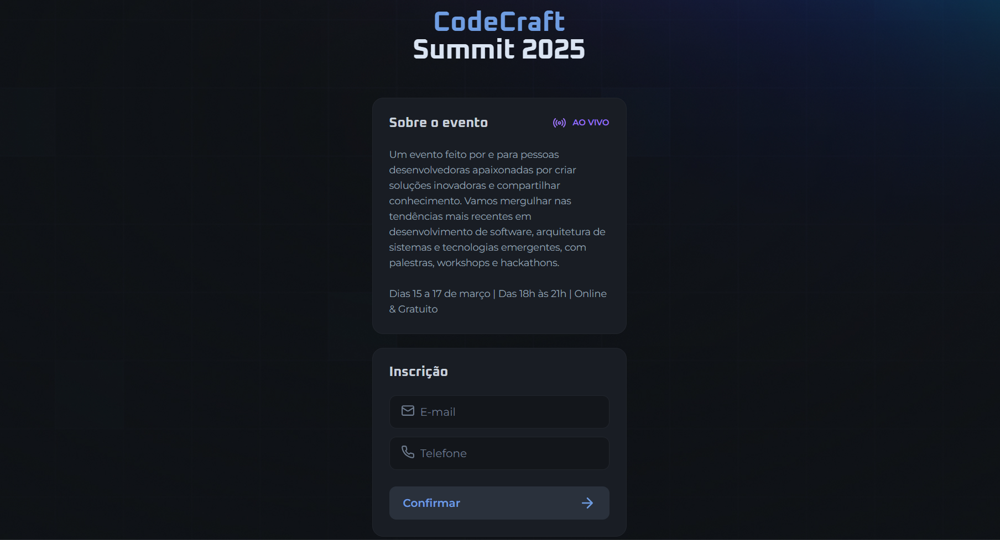

# CodeCraft Summit 2025

Este projeto é uma aplicação web simples para cadastro e gerenciamento de convites para o CodeCraft Summit 2025. A ideia é proporcionar uma experiência interativa de inscrição para um evento online, com um sistema de referência que permite aos participantes convidar amigos e acompanhar quantas inscrições foram realizadas através do seu link.

## Funcionalidades

- **Cadastro de Usuários:** Permite que os participantes se cadastrem utilizando e-mail e telefone.
- **Geração de Link de Convite:** Cada usuário recebe um link único de referência para compartilhar e convidar outros participantes.
- **Contagem de Inscrições via Referência:** Exibe, em tempo real, o número de pessoas que se inscreveram através do link do usuário.
- **Atualização Dinâmica de Imagens:** As imagens utilizadas na interface são atualizadas dinamicamente para apontar para recursos hospedados externamente.
- **Design Responsivo e Moderno:** Interface construída com HTML5, CSS3 e JavaScript, proporcionando uma experiência limpa e atraente.

## Como Funciona

1. **Exibição da Página Inicial:**  
   Ao acessar o site, o usuário é apresentado a uma página com informações sobre o evento (datas, horários, formato online e gratuito) e um formulário de inscrição.

2. **Processamento do Cadastro:**

   - Ao enviar o formulário, a aplicação verifica se o usuário já está cadastrado com base no e-mail informado.
   - Caso o usuário exista, o sistema exibe seu link de convite já gerado e a contagem de inscrições efetuadas através desse link.
   - Se o usuário não estiver cadastrado, um novo cadastro é criado com um código de referência único, e em seguida o link de convite é apresentado.

3. **Sistema de Referência:**

   - Cada usuário possui um campo `ref` que identifica seu código único.
   - O campo `refBy` indica qual código de referência foi usado para o cadastro do usuário.
   - A função que conta as inscrições filtra os usuários que utilizaram o código de referência do usuário.

4. **Atualização de Recursos Visuais:**
   - A função `updateImageLinks` ajusta os caminhos das imagens para garantir que os ícones e fundos sejam carregados corretamente a partir de uma URL externa.

## Estrutura do Projeto

- **index.html:**  
  Estrutura principal da página, contendo a marcação HTML, links para fontes, estilos e scripts.

- **main.js:**  
  Responsável pela lógica da aplicação, incluindo:

  - Manipulação do DOM e atualização de conteúdos.
  - Funções de cadastro e verificação de usuários.
  - Geração e exibição do link de convite.
  - Atualização dinâmica dos links das imagens.

- **style.css:**  
  Define o estilo visual da aplicação:
  - Layout, cores, tipografia e responsividade.
  - Estilização dos formulários, botões, seções e cabeçalho.

## Tecnologias Utilizadas

- **HTML5** – Estruturação da página e marcação semântica.
- **CSS3** – Estilização e layout responsivo.
- **JavaScript** – Lógica interativa e manipulação dinâmica do DOM.
